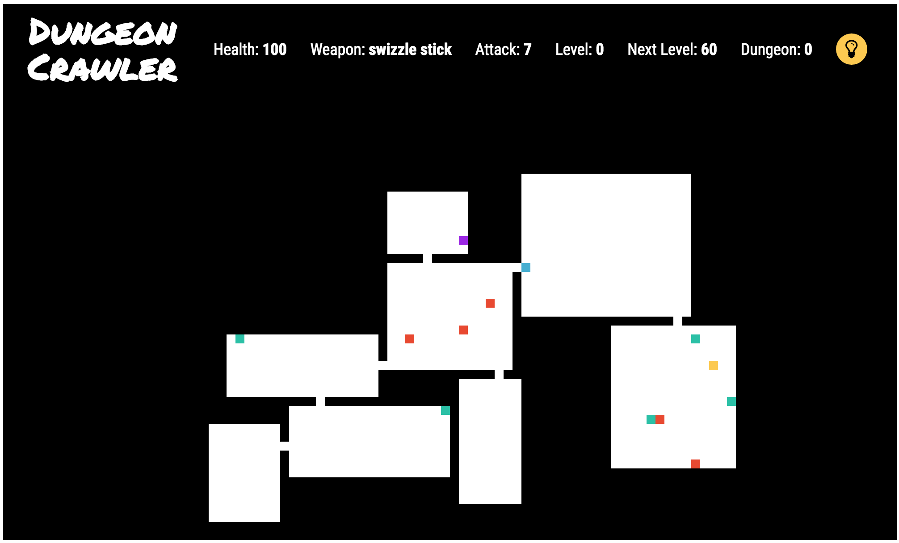

A Pen created at CodePen.io. You can find this one at <a href='http://codepen.io/terryoshea/full/mAAjEk/' target='_blank'>http://codepen.io/terryoshea/full/mAAjEk/</a>.

This was built with React for Free Code Camp's 'Build a Roguelike Dungeon Crawler Game' Project (for Data Visualization Certificate). 

The CodePen version uses Babel and SCSS; these GitHub files are compiled into pure CSS and JavaScript.

